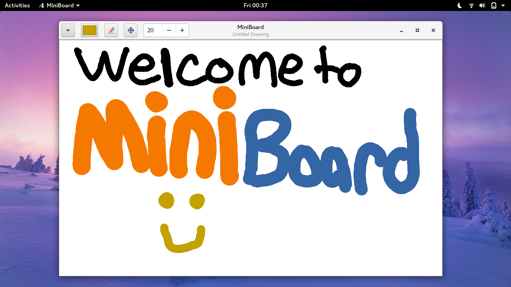

MiniBoard
---

A minimal linux application for drawing and note-taking. It is designed for touch devices but should work just as well with drawing tablets too.

This app **will** support:

- Pinch-to-zoom
- Distraction-free canvas
- Easy-to-use interface
- Basic brush color and size control

This uses Gtk+3 and Cairo. Compile using `make compile` and run using `make run`. You could do both of these at the same time by just running `make`.

